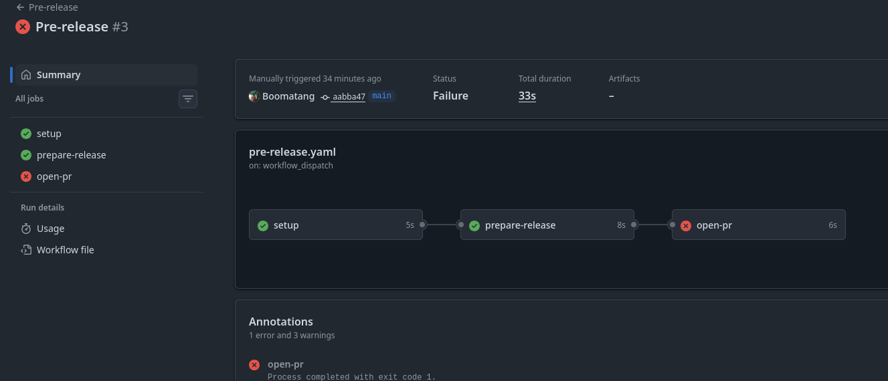
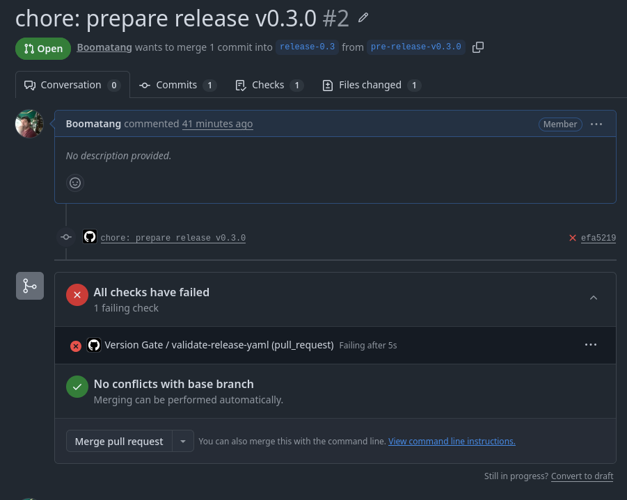
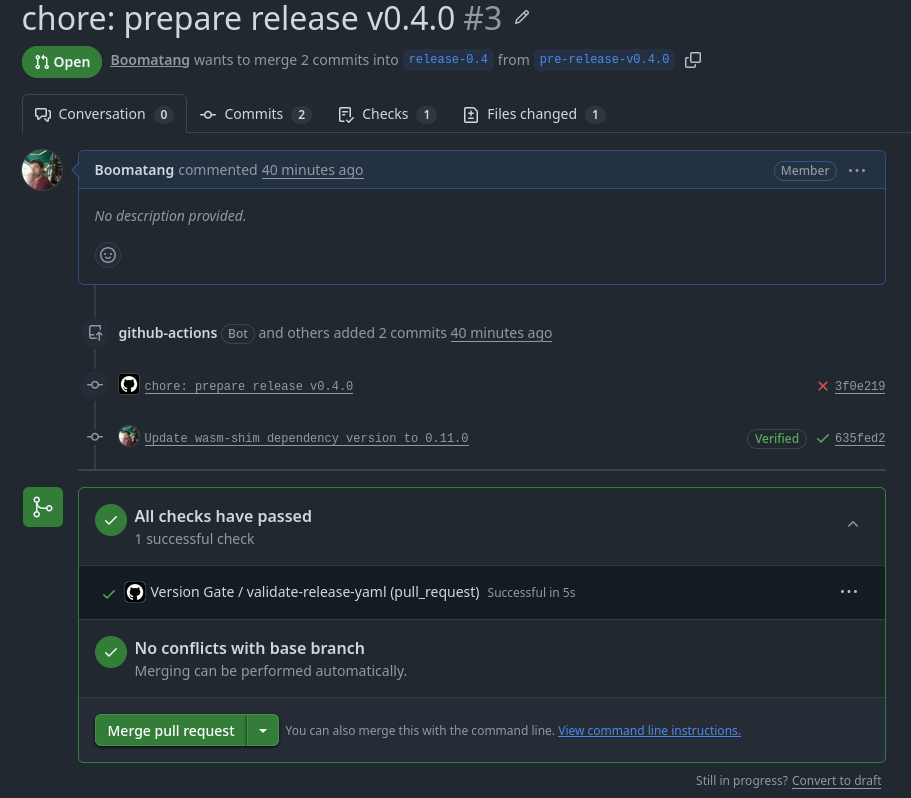
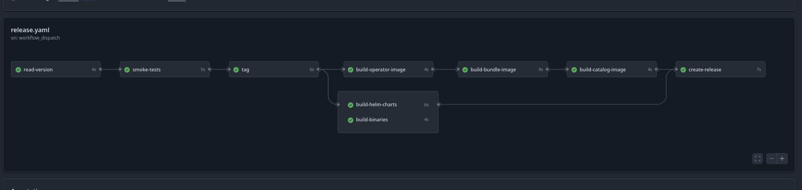
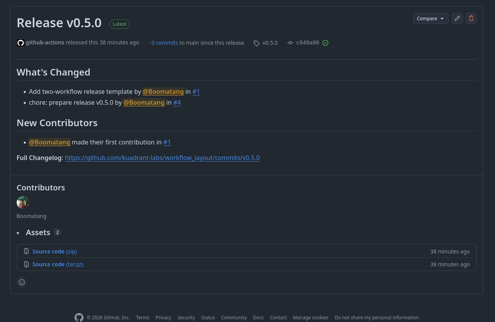

The problem
===

Our release workflows report success **before the release is actually complete**.

<!-- pause -->

A single release event triggers a cascade of loosely coupled workflows:

```
Release workflow (reports success)
  ├── push tag    → image builds (separate workflow)
  ├── push tag    → CI tests (separate workflow)
  ├── push branch → more CI tests (separate workflow)
  ├── push branch → more image builds (separate workflow)
  └── release event → helm chart sync
                        └── dispatches to another repo
```

<!-- pause -->

If a downstream workflow fails, **no one is notified** unless they happen to be watching.

<!-- end_slide -->

What went wrong in v1.5.0
===

<!-- incremental_lists: true -->

- Tests and image builds ran **in parallel** — images published before tests passed
- Helm chart sync failed for **every component** due to branch protection changes
- Unauthenticated API calls **silently returned empty responses**
- Cross-architecture builds failed with **no recovery mechanism**
- Release workflows reported **success** for all of these

<!-- end_slide -->

The fix: two workflows
===

Split every component release into two distinct phases:

<!-- column_layout: [1, 1] -->

<!-- column: 0 -->

### Pre-release

- Takes version as input
- Creates release branch if needed
- Makes code changes
- Opens a **pull request**
- Aligns with PR policy

<!-- column: 1 -->

### Release

- Triggered after PR merges
- Runs tests **first**
- Builds artifacts sequentially
- Creates GitHub release **last**
- **No code changes allowed**

<!-- reset_layout -->

<!-- end_slide -->

The release.yaml file
===

Each component repo has a `release.yaml` that tracks versions:

```yaml
workflow_layout:
  version: "0.1.0"

dependencies:
  wasm-shim: "0.2.0"
```

<!-- pause -->

Dependencies can be in two states:

- `"0.0.0"` — targeting latest, used on `main`
- A specific version — targeting a release, used on release branches

<!-- pause -->

This is how we **gate operator releases on operand availability**.

<!-- end_slide -->

Demo: pre-release workflow
===

The pre-release workflow is triggered manually with a version input.

It runs three jobs:

<!-- incremental_lists: true -->

- **setup** — validates semver, creates release branch from `main` if needed
- **prepare-release** — updates `release.yaml`, runs component-specific steps, commits and pushes
- **open-pr** — opens a PR to the release branch

<!-- end_slide -->

Demo: pre-release in action
===

We triggered pre-release for versions `0.3.0`, `0.4.0`, and `0.5.0`.

<!-- pause -->

The `setup` and `prepare-release` jobs succeeded — release branches were created and pre-release branches pushed.

<!-- pause -->

The `open-pr` job failed:

```
GitHub Actions is not permitted to create or approve pull requests
```

<!-- pause -->

This is an **org-level setting** on the free tier. PRs were created manually instead.

<!-- pause -->



<!-- end_slide -->

Demo: version gate — blocking a bad release
===

PR #2 targets `release-0.3` with `release.yaml` declaring a dependency on `wasm-shim: "0.2.0"`.

<!-- pause -->

The **Version Gate** check runs and fails:

```
Dependency 'wasm-shim' targets version '0.2.0',
but release v0.2.0 does not exist in kuadrant-labs/wasm-shim
```

<!-- pause -->

This is the version gating in action — the operator **cannot release** until the operand release exists.

<!-- pause -->



<!-- end_slide -->

Demo: version gate — passing
===

PR #3 targets `release-0.4` with a valid `release.yaml`.

The dependency points to a real release.

<!-- pause -->

The **Version Gate** check passes.

<!-- pause -->



<!-- end_slide -->

Demo: the release workflow
===

After PR #4 (`v0.5.0`) was merged into `release-0.5`, the release workflow was triggered.

The job dependency graph enforces the correct order:

```
read-version
     │
smoke-tests
     │
    tag ──────────────────────────────
     │              │                │
build-operator   build-helm      build-binaries
     │
build-bundle
     │
build-catalog
     │              │                │
     └──────── create-release ───────┘
```

<!-- end_slide -->

Demo: release workflow results
===

All 9 jobs completed successfully **in the _correct order_**:

```
read-version       ✓
smoke-tests        ✓
tag                ✓
build-operator     ✓
build-helm-charts  ✓
build-binaries     ✓
build-bundle       ✓
build-catalog      ✓
create-release     ✓
```

<!-- pause -->

The GitHub release `v0.5.0` was created **last**, only after every artifact job succeeded.

<!-- pause -->



<!-- end_slide -->

Demo: the GitHub release
===



<!-- pause -->

The release was created with `--generate-notes`, pulling commit history automatically.

In a real component, binary artifacts would be attached here.

<!-- end_slide -->

What this guarantees
===

<!-- incremental_lists: true -->

- Tests **must pass** before any artifacts are built
- Images build in dependency order: operator → bundle → catalog
- Helm charts synced via **pull request**, not direct push
- The GitHub release is the **last** artifact — if anything fails, there is no release
- **No code changes** during the release workflow
- **No downstream workflow triggers** — everything is contained
- Version gating **prevents** operators releasing before their operands

<!-- end_slide -->

How sector fits in
===

Sector moves to a **multi-phase** approach:

<!-- pause -->

1. Trigger **pre-release** workflows for all components — PRs opened for operands and operators

<!-- pause -->

2. Operand PRs merge → sector triggers **release** workflows for operands

<!-- pause -->

3. Operand releases unblock operator PR checks → operator PRs merge

<!-- pause -->

4. Sector triggers **release** workflows for operators and kuadrant-operator

<!-- pause -->

The `release.yaml` version gate is what connects these phases — operator PRs **cannot pass CI** until their operand releases exist.

<!-- end_slide -->

What's next
===

<!-- incremental_lists: true -->

- Standardise the two-workflow model across all component repos
- Update sector for multi-phase releases
- Resolve the GitHub Actions PR creation permission on the org
- Replace placeholder steps with real build logic per component
- Add helm chart PR creation with cross-repo token

<!-- end_slide -->
